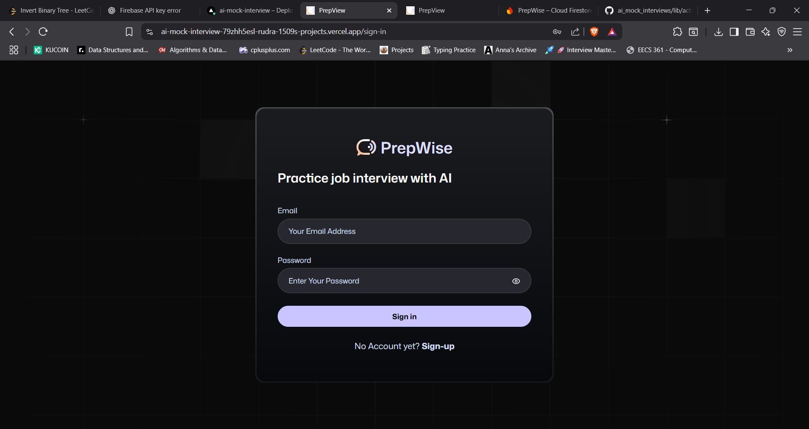
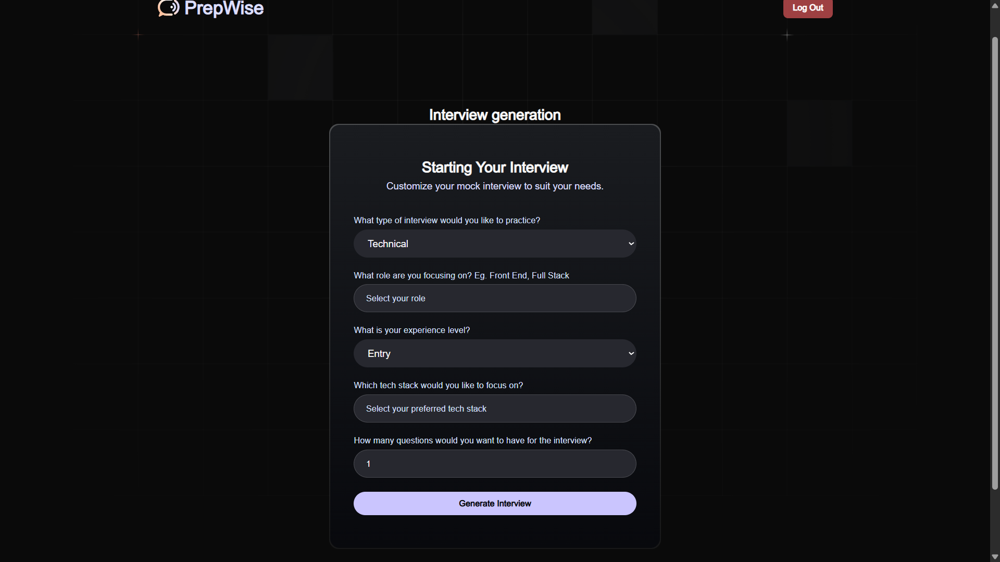
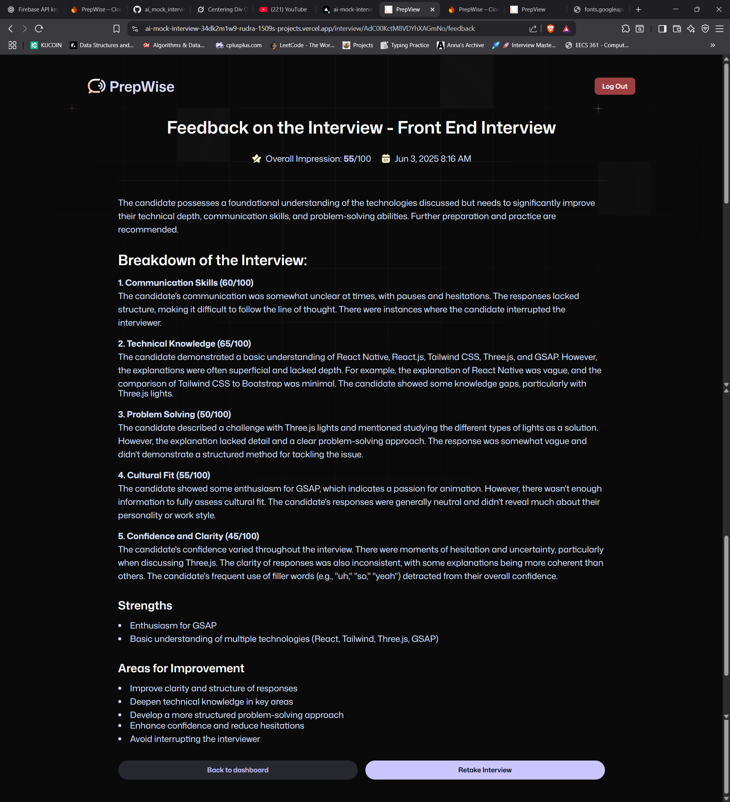

# 🎤 AI Mock Interviewer

An AI-powered, **voice-based mock interview platform** that simulates real interview experiences and gives actionable feedback — right in your browser.

🌐 **Live App:** [ai-mock-interview.vercel.app](https://ai-mock-interview-a8r3qg1s9-rudra-1509s-projects.vercel.app/)

---

## 🚀 Features

- 🎙️ **Voice-based Interview Experience**  
  Simulates real-time interview sessions with AI asking questions and listening to your answers via voice.

- 🔁 **Retake Interviews**  
  Practice multiple times with different questions and scenarios.

- 📊 **AI Feedback & Scoring**  
  Get detailed performance evaluation and scores across multiple dimensions like communication, technical accuracy, and clarity.

- 🌐 **Public & Shared Interviews**  
  View interviews generated by other users and practice them as well.

- 🔐 **Authentication via Firebase**  
  Sign in/sign up with Firebase SDK (Email/Password, Google, etc.) to generate or save interviews.

- ⚙️ **Fully Customizable**  
  - Interview type: `Technical`, `Behavioral`, or `Mixed`
  - Role: e.g., Frontend, Full Stack, Backend
  - Experience Level: `Entry`, `Mid`, `Senior`
  - Tech stack: You choose (React, Node.js, etc.)
  - Number of questions

---

## 🛠️ Tech Stack

### Frontend
- **Framework:** Next.js (App Router)
- **Styling:** Tailwind CSS
- **Forms:** React Hook Form + Zod
- **Voice & AI:**
  - Vapi (for voice input/output)
  - OpenAI (for question generation and feedback)
  - Deepgram (for speech-to-text transcription)

### Backend
- **Auth & DB:** Firebase SDK
  - Firebase Authentication for secure login/logout
  - Firestore for storing interviews and feedback
- **Interview Sharing:** Users can access interviews created by others via a shared route

### Deployment
- **Platform:** Vercel

---

## 📸 Screenshots

Here are some key visuals from the app:

| Screenshot | Description |
|------------|-------------|
|  | 🔐 User authentication screen using Firebase |
|  | 🏠 Landing page with option to issue or take interviews |
|  | 🛠️ Form to customize and generate your AI interview |
|  | 📊 AI-generated feedback and score breakdown after the interview |

---

## 🎥 Demo Video

Watch a full 6-minute AI-powered mock interview in action:  
[▶️ Watch on Google Drive](https://drive.google.com/file/d/1qoblOX0HrSB5v2XxKTSn4pJBE4yVNvlD/view?usp=sharing)

---

## 🧠 How It Works

1. **Login or Register** via Firebase Authentication.
2. **Generate Your Interview:** Customize parameters like type, role, stack, etc.
3. **Start the Interview:** AI speaks questions; you answer via voice.
4. **AI Evaluation:** After completion, AI analyzes your responses and generates feedback.
5. **Access Others’ Interviews:** Practice from interviews generated by other users too.
6. **Retake or Re-customize:** Try different variations to improve.

---

## ✨ Upcoming Features

- 📥 Download PDF feedback reports
- 📈 Dashboard to track progress
- 🧑‍💻 Agent-based collaborative interviewers
- 💾 Interview session history and notes

---

## 📬 Feedback & Contributions

If you have feature suggestions or bug reports, feel free to open an issue or contribute via pull request.

---

